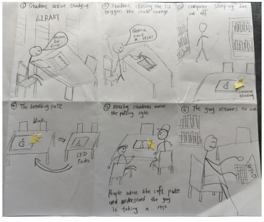
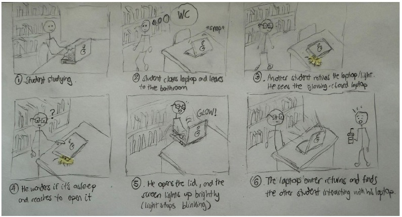
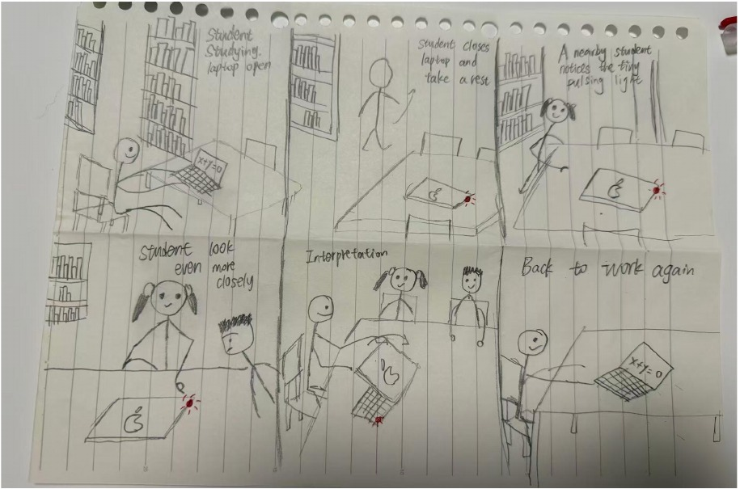
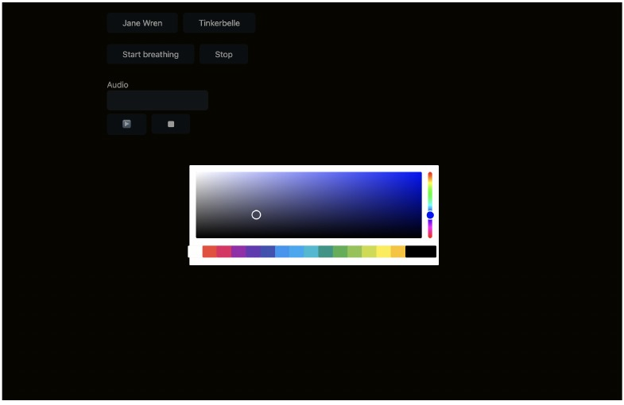
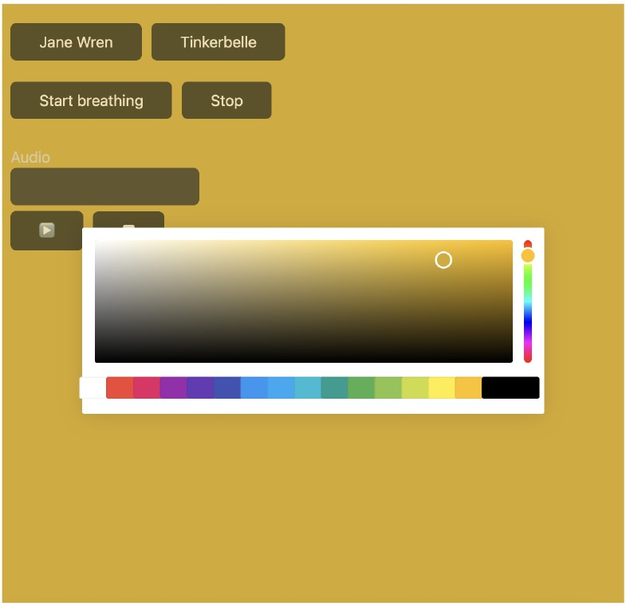

# Recreating the Masters of Interactive Light

_This project is to be done in teams of 2._

**COLLABORATORS Yuge Xu (NetID: yx692), Youzhu Jin (NetID: yj578)**

**THE MASTERWORK The “Breathing” Sleep Light"**

---

One way to understand greatness is to look to the greats. Just as painters learn
the technique and artistry of the old masters by recreating their paintings, so
too shall we come to understand computer-mediated interaction by recreating the
interactive masterworks of our time.

This week, every team will draw a different masterwork from a hat. Some are
conceptual pieces, some are historical works, some are modern-day products —
but they all share one thing: **their central mode of interaction is carried by
light.** Think of Tinker Bell in the original stage production of *Peter Pan*,
represented by nothing more than a darting circle of light from an off-stage
mirror. There was no actor playing Tinker Bell; she existed entirely through the
way the other characters interacted with that light.

Your job is to recreate the *interaction* of the piece you drew — not to build a
museum-grade replica, but to stage the moment that makes it what it is. Someone
who knows your piece should watch your recreation and recognize it instantly.
Someone who has never heard of it should walk away understanding what it is
famous for.

You will do this using the interaction staging techniques we will use all semester: a
storyboard, some acting, a phone standing in as a controllable light (the
*Tinkerbelle* tool), a hidden human "wizard" driving it, a costume, and a
recorded video.

*Make sure you read all the instructions and understand the whole activity
before starting!*

## Prep

To start, you will need:

1. Read about Git [here](https://git-scm.com/book/en/v2/Getting-Started-What-is-Git%3F).
2. Set up your own Github "Lab Hub" by forking the [Interactive-Lab-Hub repository](https://github.com/IRL-CT/Interactive-Lab-Hub). To get lab updates, simply use [GitHub's "Sync fork" button](https://docs.github.com/en/pull-requests/collaborating-with-pull-requests/working-with-forks/syncing-a-fork) when new content is available.

3. Set up your `README.md` so it has your name and links to this lab. Learn to
   format a README [here](https://docs.github.com/en/get-started/writing-on-github/getting-started-with-writing-and-formatting-on-github/basic-writing-and-formatting-syntax).
4. **Draw your masterwork from the hat and write it at the top of this file.**
   Whatever you drew is yours — lean into it.

## Materials

For this lab you will need:

1. Paper, markers/pens, scissors
2. A smartphone with a browser that can display a webpage (your stand-in "light")
3. A computer to host the control webpage
4. Found objects and materials to **costume your phone so it looks like the
   device in your masterwork** — doll clothes, a paper lantern, a bottle, foil,
   a cardboard shell, whatever it takes. Be resourceful.

## Deliverables

Submit all of the following in this lab folder of your Lab Hub, as links or
uploaded files. **Each group member posts their own copy to their own Github repo**, even if the work is
shared.

1. A short **research write-up** of your masterwork (what it is, when, who made
   it, and — most importantly — what the interaction is)
2. **3 iterated storyboards** of the interaction in the masterwork
5. A **video sketch** of your prototyped interaction
6. Any **reflections** on the process

Labs are due on Mondays. Make sure this page is linked from your main class hub
page.

---

# The Report

## Part 0. Know Your Master

### User input and feedback from the work

There is no active input from the user. The breathing light is triggered by
closing the laptop lid or letting the computer go to sleep. In response, a small
white LED on the body of the machine slowly fades in and out on a gentle rhythm,
roughly a two-to-three-second cycle.

### Who is present and the relationship it colors

The relationship here is between a person and a machine. This little light was
one of the first design touches to make a cold, silent device feel almost alive.
When you glance at that slow, pulsing light, you don't think, "The computer is
off." You think, "It's sleeping." That small shift changes how close you feel to
the machine.

### What the piece is famous for, and its strengths and weaknesses

It is one of the most celebrated details in Apple's industrial design history,
often cited as a textbook example of emotional design. Its strength is that this
minimal visual language communicates a surprisingly complex piece of
information—"I am still alive, just resting"—without any words or icons at all.
Its weakness is that the feedback is entirely passive and one-directional. The
user cannot interact with the light itself.

### The core interaction

Close the lid, and the machine does not disappear. It starts to breathe instead.
A single light rises and fades on the rhythm of human sleep, telling you silently
that it has not shut down.

## Part A. Plan

### Main Scenario

A student is studying in the university library. Before temporarily leaving to use the bathroom, the student closes the laptop. While the laptop is closed, its breathing light begins to pulse and remains visible to nearby students.

### Setting

The interaction takes place in a university library while students are studying.

### Players

The players include:

- The main user, who is studying with their laptop.
- Nearby students who are also studying in the library.
- The laptop and its breathing sleep light.

### Activity

The main user temporarily leaves to use the bathroom and closes the laptop before leaving. While the laptop is closed, its small breathing light slowly pulses and remains visible to nearby students. The light communicates that the laptop is asleep rather than completely turned off.

### Goals

The main user does not want to shut down the laptop because they plan to return shortly, so they place it in sleep mode by closing the lid. Nearby students are focused on their own work, but they may notice the breathing light and understand that the laptop is still active in sleep mode.

Now **sketch a 3 storyboards** of the interaction you are recreating. (The number may depend on the thing you drew, but stretch your thinking!) They
don't need to be beautiful, but they must capture and communicate not only the behavior of the light, but how it affects
and the people around it. If you're new to storyboarding, read
[this explanation](https://www.nngroup.com/articles/storyboards-visualize-ideas/).

Use the storyboards to decide what interaction to prototype.

### Storyboard 1: Communicating the Laptop's State

- **Frame 1:** Student studying, laptop open.
- **Frame 2:** Student finishes and closes the laptop.
- **Frame 3:** Student walks away.
- **Frame 4:** Small light starts slowly pulsing.
- **Frame 5:** Nearby students notice the pulsing light.
- **Frame 6:** Student comes back and opens the laptop.

### Storyboard 2: Direct Interaction with the Laptop

- **Frame 1:** Student studying.
- **Frame 2:** Student closes the laptop and leaves.
- **Frame 3:** Another student notices the laptop and its light.
- **Frame 4:** They wonder whether the laptop is asleep and reach out to open it.
- **Frame 5:** The light changes because the laptop is being interacted with.
- **Frame 6:** The original student comes back.

### Storyboard 3: The Light Initiates the Interaction

- **Frame 1:** Student studying.
- **Frame 2:** Student closes the laptop and leaves.
- **Frame 3:** A nearby student notices the tiny pulsing light.
- **Frame 4:** They look more closely and point it out to another student.
- **Frame 5:** They realize the laptop is still active and asleep.
- **Frame 6:** The original student returns.

### Storyboard Feedback and Prototype Selection

After reviewing the three storyboards as a team, we found that Storyboard 1 clearly communicated the laptop's sleep state, while Storyboard 2 introduced unnecessary physical interaction. Storyboard 3 best showed both the breathing light and its effect on nearby people, so we selected it as the basis for our prototype.

## Part B. Act out the Interaction

Physically act out the interaction you planned. For now, just pretend the light
is doing what you've scripted — a person can wave a flashlight, or you can narrate
it aloud.

We acted out the scene using a flashlight to stand in for the breathing light. One of us played the student who was studying, and the other played a nearby student in the library.

### Were Things Different in Real Life Than on Paper?

Yes. On paper, we assumed a nearby student would just glance at the light and instantly understand that the laptop was simply asleep. But when we acted it out, this felt too easy. If you don't already know about this design, a stranger's laptop glowing softly isn't obviously "sleeping." It could just look unusual or make someone curious. Understanding the light isn't as automatic as we first thought.

### Did New Ideas Come Up While Acting It Out?

Yes. We realized the light isn't just communicating with its owner. Other people nearby are watching it too, and they might interpret it differently. Some people would recognize it and leave it alone, while others might become curious and want to check it out. We hadn't considered this difference when we were planning on paper.

### Where Could Things Go Differently?

We found one key moment where the story could take two different paths: immediately after a nearby student notices the glowing light.

In one version, the student gets curious and opens the laptop to see what is happening. The screen suddenly lights up brightly. A moment later, the laptop's owner returns and finds someone else touching it, creating an awkward situation.

In the other version, the student leans in for a closer look, realizes the light means the laptop is only sleeping, and leaves it alone. Both students quietly return to their own work, and nothing is disrupted.

Acting out these two outcomes helped us understand and refine the differences among our three storyboards. The first presents a simple, linear story, while the second and third explore how the same moment can unfold differently depending on how the observer reacts.

## Part C. Prototype the Light (light first!)

Use your smartphone as the light of your device. Open the browser on your phone
to act as the "light," and use the remote control interface on your computer to
change that light. Code and setup instructions for the *Tinkerbelle* tool are
[here](https://github.com/IRL-CT/tinkerbelle) (we invented this tool for
this lab). If you hit technical trouble, a manually or remotely controlled light
switch, dimmer, or lamp is a fine substitute.

**Get the light interaction working before anything else.** Your grade this week
rides on the *light* being recognizable — the color, the rhythm, the timing, the
way it answers a person. Only once your light interaction genuinely reads as your
masterwork should you consider layering in a second modality (sound, vibration,
motion). If in doubt, keep polishing the light. The other modalities are next
week's business.

We used Tinkerbelle to control the phone screen remotely. When presses “Start breathing,” the screen gradually fades in and out in a yellow light on a two-to-three-second cycle, recreating the laptop's sleep indicator.

## Part D. Wizard the Device

Set up a "wizard" arrangement so one person can secretly drive the light while
another acts with it — this is how you make the device feel alive without
building any real electronics. (Zoom works well for recording; you can pin the
video feed of whichever scene you want to capture.)

[First Wizarded Setup Attempt](https://drive.google.com/file/d/1Uhwu_z-rbWRkaqgAyHLR0zJx9suE3YzQ/view?usp=drive_link)

Youzhu Jin secretly controlled the breathing light through Tinkerbelle while Yuge Xu acted out the interaction with the laptop.

## Part E. (optional) Costume the Device

Only now should you worry about what the device looks like. Costume your phone so it reads
as the object from your masterwork — HAL's eye, a Simon shell, a paper-lantern
Tinker Bell, an Ambient Orb, a lighthouse, a jack-o'-lantern, whatever you drew.

Think about the world your device lives in: could that environment overheat it?
Is water a danger? Does it need to be loud and bright for an emergency, or quiet
and calm for a bedroom?

**Include sketches/photos of what your device might look like here.**

**What concerns or opportunities shaped the way you designed its look?**

## Part F. Record

**Record your prototyped interaction as a video sketch.** Aim for the bar from
the top of this lab: a viewer who knows the piece should recognize it; a viewer
who doesn't should come away understanding what it's famous for. How might you illustrate the non-sequential aspects of the interaction in the sketch?

[Final Video Sketch](https://drive.google.com/file/d/1PaZeyPPfI2rwBXfLMNF6pYCnSPNnsKAl/view?usp=drive_link)

This lab was completed in collaboration with Youzhu Jin and Yuge Xu. We worked together on the storyboards, acted out the interaction, controlled the breathing light, and recorded the final video sketch.

---

# Part 2 — ReMastering the light

*This describes the second week's work for this lab activity.*

## Prep (before the next lab)

Find three other groups. (How? Maybe Slack?) Visit their Lab Hub pages, watch their
videos, and give them reactions and feedback: tell them what you saw happening,
guess the masterwork and the goals of the characters, and ask about anything that
wasn't clear.

### Groups We Kibitzed With

1. [certaindragon3's Lab 1](https://github.com/certaindragon3/Interactive-Lab-Hub/tree/Fall2026/Lab%201)
2. [zijiz's Lab 1](https://github.com/zijiz/Interactive-Lab-Hub/blob/Fall2026/Lab%201/README.md)
3. [davidzhanggg's Lab 1](https://github.com/davidzhanggg/Interactive-Lab-Hub/tree/Fall2026/Lab%201)

### Feedback We Received

After watching our video, our peers correctly identified the masterwork as a laptop's sleep indicator light, mainly because of its slow pulsing rhythm. They also understood the setting: a student briefly stepping away in the library without completely shutting down the laptop.

They asked whether the light's color or brightness communicated something different from its rhythm because the light appeared slightly different in a few frames. This made us realize that the interaction's meaning comes primarily from the slow, repeating pulse rather than from changes in color or brightness.

Their main suggestion was to make the fade slower and more visible, since subtle changes in brightness are harder to notice on video than in person.

## Remix, Update, or Critique the Master

### Design Direction and Code Update

For our second iteration, we chose to update the breathing sleep light and push
its emotional feedback further. The original light communicated only one calm,
passive state. Our revised prototype adds two clearly different light states:

- A **slow blue breathing light** represents the laptop sleeping peacefully.
- A **faster red breathing light** represents urgency or warning when someone
  interacts with the sleeping laptop.

The change preserves the original idea of making a computer feel alive through
a breathing rhythm, while giving it a wider emotional range and making its
feedback easier to understand. The controller now includes controls for starting
and stopping both the blue sleep state and the red alert state. Both effects are
broadcast to the connected phone through Tinkerbelle.

[View the updated Tinkerbelle code](tinkerbelle-remix/)

### Updated Storyboard

_Storyboard will be added here._

### Final Video Sketch

_Final video link will be added here._

Now that you understand your masterwork from the inside, respond to it. Do the
recreation again, but this time make it your own — pick one of these moves (or
combine them):

1. **Remix the modality.** Your recreation no longer has to (just) use light. Use
   vibration, sound, motion, heat — whatever best carries the interaction. Feel
   free to fork and modify the Tinkerbelle code. (Add your updates to this lab's folder!)
2. **Update it.** Redesign the piece for today's context, or for a setting its
   creators never imagined (the piece with roommates in the room, with children
   present, on a phone, in a car).
3. **Fix its weaknesses.** You identified this master's strengths and weaknesses
   in Part 0 — now address a weakness, or push a strength further.

We will grade this second pass with an emphasis on **creativity** and on how well
your response engages with what your master was really doing.

**Document everything here — especially the storyboard and video. Photos of the
prototype are great too.**

---

*Assignment lineage: this lab merges "Staging Interaction" (Interactive Lab Hub)
with "Recreating the Masters" (Interaction Design Studio, Profs. Scott Minneman &
Wendy Ju). Massive list of interactive light masterworks generated by Claude.ai.*
